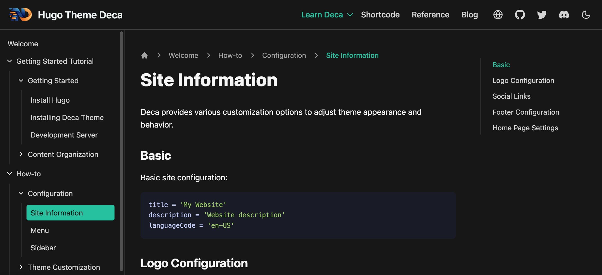

# Hugo Theme Deca

[中文](https://github.com/zhenshuo2021/deca/blob/main/README.zh-TW.md)

Deca is a modern documentation theme built for [Hugo](https://gohugo.io/), featuring seamless page transitions and multiple sidebars to deliver a smoother and more scalable documentation browsing experience.

## Core Features

* Built-in [Swup](https://swup.js.org/) with [preload plugin](https://swup.js.org/plugins/preload-plugin/) for instant page transitions
* Three-column layout for clear structure and navigation
* Multiple sidebar support for large or modular documentation
* Hugo-based build with cached rendering for faster site generation
* Minimal JavaScript, fully functional in no-JS environments
* Minimal CSS, less than 10KB
* Customizable through the Infima CSS variable system
* Core resources bundled within the theme, no CDN required, works without external network access

## Why Choose Deca

Deca integrates seamless page navigation with Swup and page preloading, delivering a silky-smooth browsing experience with no white-screen flashes or loading delays, while retaining the SEO benefits and fast initial load times of static sites.

Beyond that, Deca extensively uses caching to fully leverage Hugo's performance advantages—a capability currently unavailable in other Hugo documentation themes. Deca not only caches sidebar data to avoid repeated traversal during builds but also natively [skips collapsed sidebars](https://github.com/facebook/docusaurus/pull/5136) to accelerate builds. For large-scale sites, Deca supports the `sidebarCachedRender` option to further optimize build performance.

## License

This project is licensed under the MIT License. Please retain the original author credit in any adapted or derivative works.
