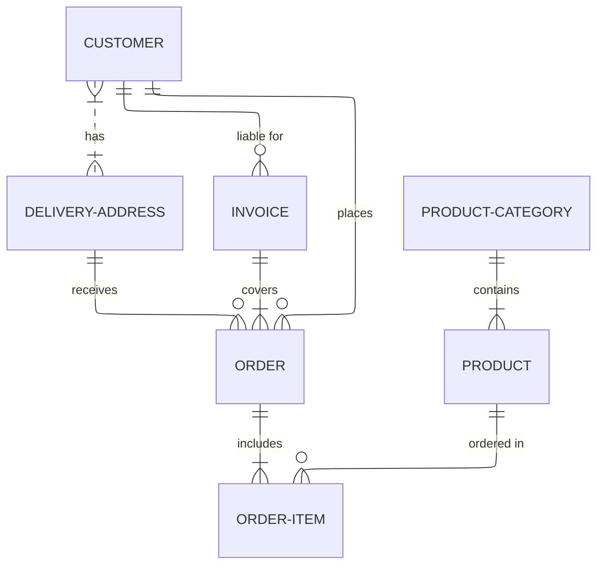

# Mermaid

[Mermaid](https://mermaid.js.org/) is a tool for rendering flowcharts in the browser.

## Usage

````md
```mermaid
// Your mermaid content
```
````

## Example

````md

```mermaid
---
config:
  layout: elk
---
erDiagram
CUSTOMER }|..|{ DELIVERY-ADDRESS : has
CUSTOMER ||--o{ ORDER : places
CUSTOMER ||--o{ INVOICE : "liable for"
DELIVERY-ADDRESS ||--o{ ORDER : receives
INVOICE ||--|{ ORDER : covers
ORDER ||--|{ ORDER-ITEM : includes
PRODUCT-CATEGORY ||--|{ PRODUCT : contains
PRODUCT ||--o{ ORDER-ITEM : "ordered in"
```
````


```mermaid
---
config:
  layout: elk
---
erDiagram
CUSTOMER }|..|{ DELIVERY-ADDRESS : has
CUSTOMER ||--o{ ORDER : places
CUSTOMER ||--o{ INVOICE : "liable for"
DELIVERY-ADDRESS ||--o{ ORDER : receives
INVOICE ||--|{ ORDER : covers
ORDER ||--|{ ORDER-ITEM : includes
PRODUCT-CATEGORY ||--|{ PRODUCT : contains
PRODUCT ||--o{ ORDER-ITEM : "ordered in"
```
