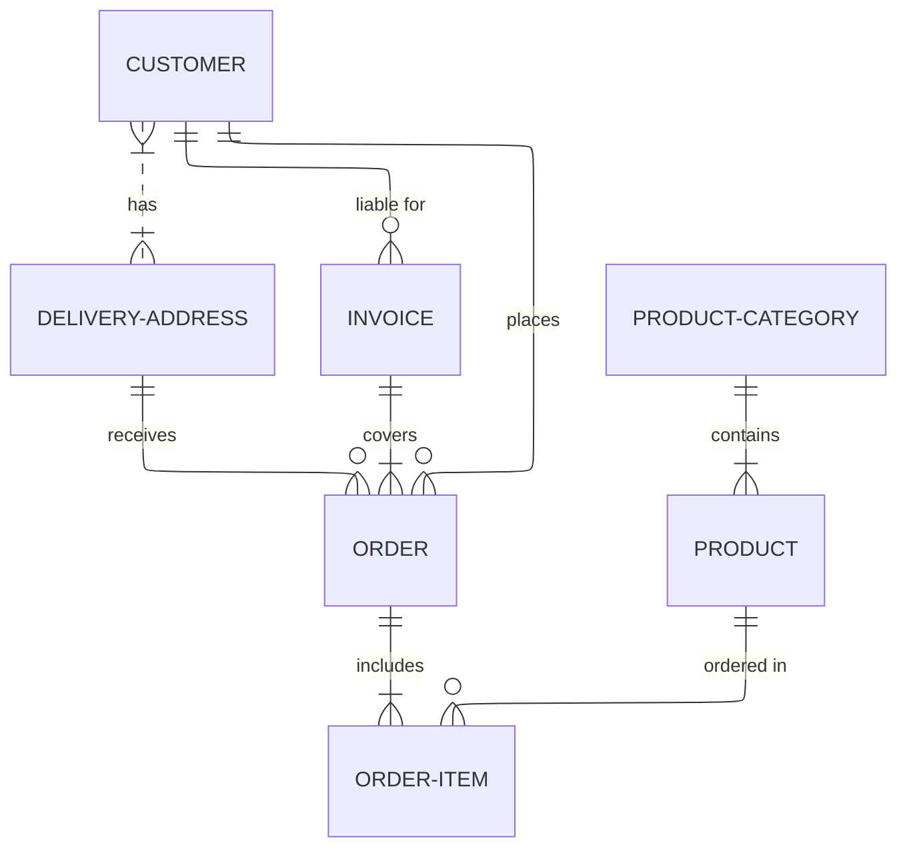

# Mermaid

[Mermaid](https://mermaid.js.org/) 是瀏覽器渲染流程圖的工具。

## 使用方式

````md
```mermaid
// 你的 mermaid 內容
```
````

## 範例

````md

```mermaid
---
config:
  layout: elk
---
erDiagram
CUSTOMER }|..|{ DELIVERY-ADDRESS : has
CUSTOMER ||--o{ ORDER : places
CUSTOMER ||--o{ INVOICE : "liable for"
DELIVERY-ADDRESS ||--o{ ORDER : receives
INVOICE ||--|{ ORDER : covers
ORDER ||--|{ ORDER-ITEM : includes
PRODUCT-CATEGORY ||--|{ PRODUCT : contains
PRODUCT ||--o{ ORDER-ITEM : "ordered in"
```
````


```mermaid
---
config:
  layout: elk
---
erDiagram
CUSTOMER }|..|{ DELIVERY-ADDRESS : has
CUSTOMER ||--o{ ORDER : places
CUSTOMER ||--o{ INVOICE : "liable for"
DELIVERY-ADDRESS ||--o{ ORDER : receives
INVOICE ||--|{ ORDER : covers
ORDER ||--|{ ORDER-ITEM : includes
PRODUCT-CATEGORY ||--|{ PRODUCT : contains
PRODUCT ||--o{ ORDER-ITEM : "ordered in"
```
